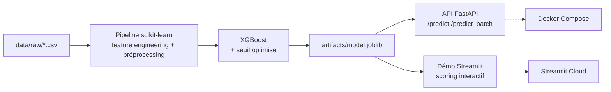

# 🏦 Churn Bank — Prédiction de l'attrition client

[](https://github.com/Narcisse-sudo/Churn-bank/actions/workflows/ci.yml)
[](https://www.python.org)
[](https://github.com/psf/black)

Projet **end-to-end de machine learning** : prédire quels clients vont quitter leur banque,
pour permettre aux équipes de rétention d'agir **avant** le départ. De l'analyse
exploratoire au modèle servi via une **API FastAPI** et une **démo Streamlit** déployable
en un clic.

> 🔗 **Démo en ligne :** _<ajoutez ici votre lien Streamlit Cloud après déploiement>_

---

##  Pourquoi c'est utile

Acquérir un nouveau client coûte **5 à 7 fois plus cher** que d'en conserver un. Détecter à
l'avance les clients à risque permet de concentrer les offres de rétention (contact,
avantages, accompagnement) sur les bonnes personnes plutôt que d'arroser tout le portefeuille.

Le modèle transforme un profil client en **probabilité de départ** et en **décision**
(à risque / non) selon un seuil optimisé.

---

##  Résultats

Modèle retenu : **XGBoost** (pondéré contre le déséquilibre), seuil de décision réglé pour
maximiser le F1. Évaluation sur un **jeu de test held-out de 28 716 clients jamais vus** :

| Métrique  | Valeur |
|-----------|--------|
| ROC-AUC   | **0.889** |
| PR-AUC    | 0.727 |
| F1-score  | **0.663** |
| Précision | 0.647 |
| Rappel    | 0.679 |

**Matrice de confusion** (6 090 départs réels dans le test) :

|               | Prédit : reste | Prédit : part |
|---------------|:--------------:|:-------------:|
| **Reste**     | TN = 20 371    | FP = 2 255    |
| **Part**      | FN = 1 953     | TP = 4 137    |

➡️ Le modèle **détecte 68 % des clients qui partent**, avec une **précision d'alerte de 65 %**
(2 alertes sur 3 sont de vrais départs). On privilégie volontairement le **F1 / PR-AUC** à
l'accuracy : avec seulement 21 % de churn, un modèle qui prédirait « personne ne part »
afficherait 79 % d'accuracy tout en étant inutile.

### Principaux facteurs de départ (importance du modèle)

1. **Nombre de produits** détenus (3+ produits = très fort risque)
2. **Solde nul** sur le compte
3. **Inactivité** du membre
4. **Âge** (les clients plus âgés résilient davantage)
5. **Pays** (clientèle allemande plus volatile)

---

##  Architecture



Le modèle sauvegardé est un **pipeline bout-en-bout** : il reçoit les variables brutes et
applique lui-même le feature engineering puis le préprocessing. Garantie d'**aucune
divergence** entre entraînement et production.

---

##  Structure du projet

```
churn-bank/
├── src/churn/              # cœur du projet (package importable)
│   ├── config.py           # schéma des données + chemins
│   ├── data.py             # chargement + split train/val/test stratifié
│   ├── features.py         # feature engineering (fonction picklable)
│   ├── preprocess.py       # ColumnTransformer (One-Hot, scaling)
│   ├── model.py            # modèles candidats + métriques + seuil
│   ├── train.py            # pipeline d'entraînement complet
│   └── predict.py          # inférence + génération de soumission
├── app/api/main.py         # service FastAPI
├── app/ui/streamlit_app.py # démo Streamlit (autonome)
├── notebooks/              # 01_exploration.ipynb (EDA)
├── tests/                  # suite pytest
├── artifacts/              # modèle + métriques (versionnés)
├── data/raw/               # train.csv / test.csv
├── Dockerfile.api · Dockerfile.streamlit · docker-compose.yml
└── .github/workflows/ci.yml
```

---

##  Démarrage rapide

### 1) Installation

```bash
python -m venv .venv && source .venv/bin/activate   # Windows : .venv\Scripts\activate
pip install -e ".[dev]"
```

### 2) Entraîner le modèle

```bash
python -m churn.train
```

Découpe stratifiée train/val/test → compare LogReg / RandomForest / XGBoost → sélectionne le
meilleur → règle le seuil → réentraîne → évalue sur le test → écrit les artefacts.

### 3) Lancer l'API + la démo

```bash
uvicorn app.api.main:app --reload          # http://127.0.0.1:8000/docs
streamlit run app/ui/streamlit_app.py      # http://localhost:8501
```

Endpoints : `/health`, `/model-info`, `/predict`, `/predict_batch` (JSON), `/predict_batch_csv` (CSV).

### 4) Avec Docker

```bash
docker compose up --build      # API sur :8000, UI sur :8501
```

---

##  Déploiement (démo publique gratuite)

**Streamlit Community Cloud** (recommandé pour un lien à mettre sur un CV) :

1. Pousser le dépôt sur GitHub (le modèle `artifacts/model.joblib` est versionné, la démo
   fonctionne donc sans réentraînement).
2. Sur [share.streamlit.io](https://share.streamlit.io) → **New app** → choisir ce dépôt.
3. **Main file path** : `app/ui/streamlit_app.py` · **Python** : 3.11.
4. Déployer : Streamlit installe `requirements.txt` et publie une URL publique. 🎉

---

##  Qualité & CI

```bash
pytest            # suite de tests
ruff check .      # lint
black --check .   # format
```

Chaque push déclenche la **CI GitHub Actions** : lint → entraînement → tests → build des deux
images Docker.

---

##  Données

[Bank Customer Churn (Kaggle)](https://www.kaggle.com/) — 143 579 clients étiquetés, 14 colonnes
(données fictives à but pédagogique). Cible : `Exited` (1 = le client a quitté la banque).
`test.csv` n'est pas étiqueté et sert à générer une soumission via `python -m churn.predict`.

##  Pistes d'amélioration

- Calibration des probabilités (isotonic / Platt) pour des scores directement actionnables.
- Réglage du seuil sous **contrainte métier** (coût d'un faux négatif vs faux positif).
- Suivi d'expériences (MLflow) et monitoring de drift en production.
